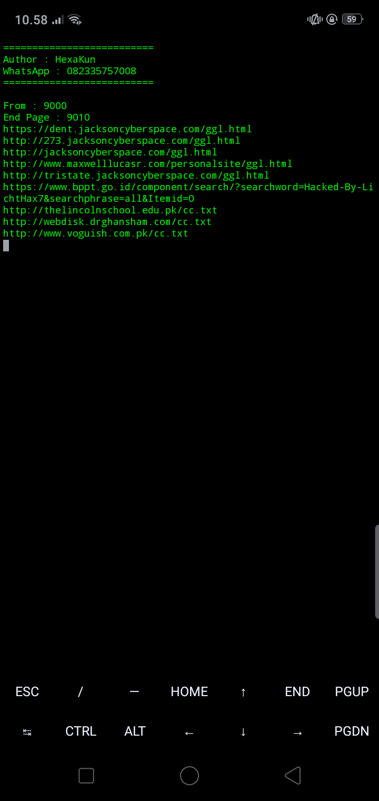
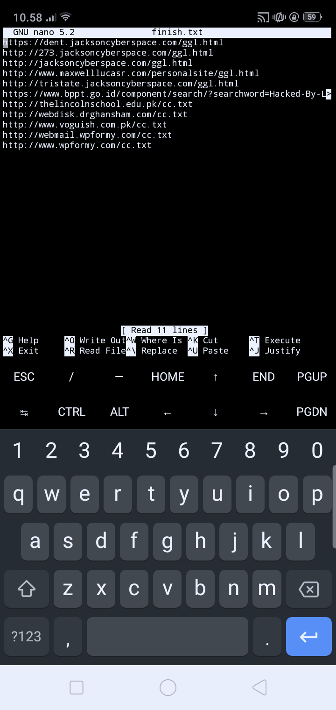

## Info
***
- 1. This tool is no longer being developed.
## How To Use
***
- $ apt install python2
- $ pip2 install requests
- $ pip2 install bs4
- $ python2 grab.py
## Screenshot
***
- Run

- Result Saved in finish.txt

## Thank you
- Thanks for the support, Have a nice day
